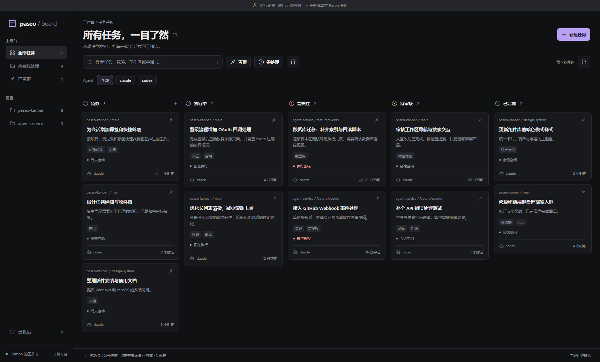

# Paseo Kanban

面向 **Paseo 0.7.2** 的原生任务 / 会话看板插件。把分散在多个工作区的会话汇总为卡片，以类似 Multica 的方式推进任务：记录待办、交给 Agent、查看进度、人工审核、确认完成。



## 已实现

- 全局侧边栏入口，以及单个工作区的看板标签页。
- 自动读取当前主机的全部未归档会话，处理分页；无需逐个导入。
- 五列工作流：**待办 → 执行中 → 需关注 / 待审核 → 已完成**。
- 跨项目搜索标题、说明、标签、路径、提供商和会话 ID；项目 / Agent / 置顶 / 需处理筛选。
- 桌面拖动移动、同列排序；手机与键盘用户可在详情里使用“移动到”按钮。
- 在“待审核”列一键将当前筛选范围内的全部任务标记为完成。
- 置顶、标签、优先级、任务备注、收起与恢复；收起不停止或归档 Paseo 会话。
- 新建任务保存为草稿；选择实际可用的 Agent 模型，点击“开始执行”后，在所选现有工作区中创建会话并发送任务说明。
- 新建任务时可拖拽或选择图片、文档等附件；附件随任务保存，并在开始执行时一并交给 Agent。最多 10 个，单个不超过 20 MB，总计不超过 50 MB。
- 从未启动过的看板任务可在详情中二次确认后永久删除；删除任务时会同时清理其附件。已进入启动流程或已关联会话的任务不会显示删除入口。
- 新建任务可选择提供商实际支持的运行模式，优先默认 **Full Access**（Claude 对应 **Bypass**）；模式随任务保存并传入 Agent 启动配置。若提供商没有全权限模式，则默认其第一个可用模式；不提供模式列表时沿用 Agent 默认行为。历史任务不自动改变权限。
- 直接打开对应 Paseo 会话或工作区。
- 服务端 JSON 持久化，同一 daemon 的客户端共享任务数据；每 5 秒刷新。
- 遵循 Paseo 主题色和紧凑布局。快捷键：`/` 搜索、`N` 新建、`Esc` 关闭。

## 安装到 Paseo

需要 Paseo **0.7.2**。v0.8 的双入口插件格式尚未适配。

1. 在 Paseo **Settings → Plugins** 中开启 **Enable plugins**。
2. 在运行 daemon 的电脑上安装此目录：

```powershell
& 'C:\Program Files\Paseo\resources\bin\paseo.cmd' plugin install 'J:\ai-ideas\paseo-kanban'
& 'C:\Program Files\Paseo\resources\bin\paseo.cmd' plugin ls
```

若 `paseo` 已在 PATH 中，也可直接运行：

```sh
paseo plugin install /absolute/path/to/paseo-kanban
paseo plugin ls
```

3. 状态显示 `running` 后，在侧边栏打开 **任务看板**。也可按 `Ctrl+K` / `⌘K`，搜索 **打开全局任务看板** 或 **打开工作区看板**。

Paseo 提供运行时依赖并编译插件，直接安装本地目录无需先构建网页预览。插件总开关影响该 daemon 的所有插件；本项目不会自动修改它。详见 [Paseo v0.7 官方安装说明](https://paseo.sh/docs/plugins/v0.7#check-and-install-it)。

修改源码后：

```sh
npm run typecheck
paseo plugin reload paseo-kanban
paseo plugin logs paseo-kanban
```

## 工作流规则

| 情况 | 看板行为 |
| --- | --- |
| 新建但未执行的任务 | 待办；不启动 Agent，不消耗模型调用 |
| Agent 正在启动或执行 | 执行中 |
| 等待权限或执行错误 | 需关注；到原会话处理 |
| 当前轮结束 / 导入的空闲会话 | 待审核 |
| 人工确认完成 | 已完成 |
| 已完成的会话收到新提示 | 重新按实际运行状态归类 |
| 仅修改备注、标签或优先级 | 保留本轮人工进度 |
| 从看板收起 | 从默认视图隐藏；可在“已收起”恢复 |

正在执行的会话不能直接标记完成；拖动不会启动或停止 Agent。卡片排序先比较置顶，再比较优先级，然后是拖动顺序和更新时间，因此不同优先级的卡片仍按优先级排列。

任务标题 / 说明属于看板元数据，不重命名原始会话，也不改写原始聊天记录。任务启动时发送一次说明，之后通过原 Paseo 会话继续沟通。已有会话不复制到新工作区，不自动创建 worktree 或合并代码。

## 数据与启动恢复

数据保存在 daemon 机器的 `$PASEO_HOME/paseo-kanban/board.json`；未设置 `PASEO_HOME` 时使用 `~/.paseo/paseo-kanban/board.json`。任务附件保存在同目录的 `attachments/` 中，`board.json` 只记录附件元数据与路径，不内嵌文件正文。当前实现每个 daemon 使用一份看板；请勿将本插件以多个 runtime ID 同时安装，因为它们会共享这些文件。

文件使用串行写入和临时文件原子替换；读取到损坏数据时显示错误，不覆盖原文件。附件删除被中断时，下次读取看板会自动恢复仍被任务引用的目录、清理已经删除任务的目录。备份时请复制整个 `paseo-kanban` 目录。卸载插件保留该目录，重新安装可继续使用。

任务创建带有客户端幂等标识；即使保存成功后的 RPC 响应丢失，在同一新建窗口中重试也会返回已保存的任务，不会重复创建任务或附件。

任务启动前记录启动状态，并给新会话设置唯一任务标签。若响应丢失，再点 **检查并关联会话** 会查找已创建的会话，不自动重复执行。如果仍无法确认，任务保留待确认状态；请先在 Paseo 检查。确认没有创建会话后，可收起该任务并新建任务重试。已归档 / 不可用的关联会话不会变成新的未启动任务。

## 本地交互预览

```sh
npm ci
npm run dev
```

打开 <http://127.0.0.1:5173>；浅色主题为 <http://127.0.0.1:5173/?light>。预览复用插件 UI，使用明确标注的示例数据，保存于浏览器 `localStorage`，**不连接或操作真实 Paseo 会话**。它不是实际插件的入口。清除该站点的 `paseo-kanban-preview-v1` 存储项可重置示例。

## 验证

Node.js 22+：

```sh
npm ci
npx playwright install chromium
npm run check
```

- `npm run typecheck`：类型检查，依赖锁定 Paseo SDK 0.7.2。
- `npm test`：33 个核心测试，覆盖分页、真实 RPC 校验、状态转换、批量完成的原子性与大列表输入、数据保存、损坏保护、附件持久化 / 启动转交 / 删除恢复与路径保护、任务创建与 Agent 启动去重 / 响应丢失恢复、运行模式默认与持久化，以及真实 SDK 的参数转换。
- `npm run test:e2e`：9 个浏览器场景，覆盖搜索、创建 / 编辑 / 启动、附件拖放与未启动任务删除、模式选择与切换提供商、单个及批量完成、拖动 / 收起 / 恢复、窄屏与运行中完成保护。
- `npm run build:preview`：独立网页预览构建。
- `npm run verify:host`：调用已安装 Windows Paseo 的真实插件编译器，只检查 manifest 和双运行时编译，不安装或启用插件。自定义安装路径可设置 `PASEO_RESOURCES` 和 `PASEO_ELECTRON`。

只读 daemon 冒烟验证（把端口替换成 `paseo daemon status --json` 中的实际值）：

```sh
npx tsx scripts/smoke-daemon.ts ws://127.0.0.1:16767/ws
```

只输出会话 / 工作区 / 模型数量，不发送提示、不保存看板、不更改配置。本机验收读取了 60 个会话、29 个工作区和 7 个模型；真实 Agent 启动未执行，以免给现有工作区发出测试任务。浏览器测试使用模拟会话，iOS / Android 目前只完成平台兼容实现，未在真机验收。

## 代码结构

```text
index.ts                    Paseo v0.7 插件注册
src/board.client.tsx        共用的 React Native UI
src/model.shared.ts        数据模型、状态映射、搜索与排序
src/contracts.shared.ts    带验证的 RPC 输入 / 输出
src/handlers.server.ts     daemon 数据路径与 RPC 绑定
src/service.server.ts      SDK 集成、任务操作、启动恢复
src/store.server.ts        串行写入与原子持久化
preview/                   隔离的交互预览
tests/                     核心测试与浏览器验证
scripts/                   宿主编译和只读 daemon 检查
```

接口参考：[Paseo v0.7 插件文档](https://paseo.sh/docs/plugins/v0.7/reference)、[TypeScript SDK](https://paseo.sh/docs/sdk/quickstart)。工作流灵感来自 [Multica](https://github.com/multica-ai/multica)，未复制其代码。
